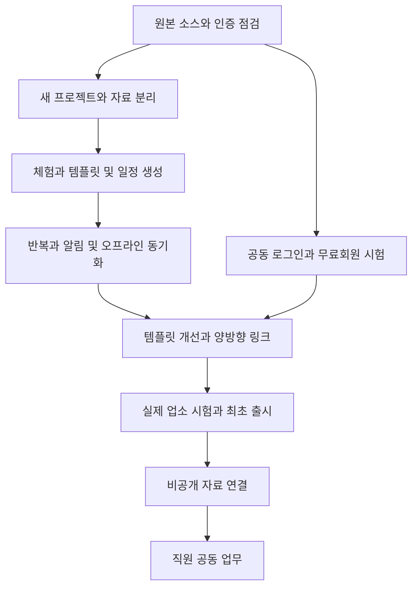

# 요리사 일정관리 개발 작업과 검수 기준

제품·기술·회원 설계를 구현하기 위한 작업 목록이다. 우선순위 P0는 최초 출시의 필수 조건, P1은 출시 후 첫 확장, P2는 사용 결과에 따라 결정할 기능이다. 단계의 완료는 코드 작성뿐 아니라 검수 조건을 충족한 상태를 뜻한다.

## 개발 순서와 의존 관계

원본 소스와 인증 점검의 결과가 기술·회원 연결 경로를 결정한다. 일정 기본 기능은 회원 연결 POC와 별도로 개발할 수 있으나 최초 공동 출시를 완료하려면 회원·양방향 이동 검증도 통과해야 한다.

## 최초 출시 작업

| 번호 | 우선순위 | 작업 | 의존 | 완료 조건 |
|---|---|---|---|---|
| CP001 | P0 | 원본 일정관리 소스 확보와 기준 기록 | 없음 | 저장소·commit·라이선스·인증·DB·배포·반복 로직 목록, 원본 화면 회귀 기준 |
| CP002 | P0 | 재사용과 기술 결정 | CP001 | 재사용 파일 목록, 새 Flutter 또는 대안 선택 근거, SDK·알림·저장 POC, ADR 승인 |
| CP003 | P0 | 새 저장소와 개발 환경 | CP002 | 별도 앱 식별자·프로젝트 설정, 합성 fixtures, 비밀 파일 제외, 초기 개발 검사 |
| CP004 | P0 | 화면 구조와 접근성 | CP003 | 4개 메뉴와 핵심 화면, 큰 글자·작은 화면·한국어 날짜, 시작·완료 조작 시험 |
| CP005 | P0 | 템플릿 catalog와 개인 버전 | CP003 | 6개 템플릿, key·선행 관계·범위 검증, 게시 버전 불변, 개인 수정·복원 |
| CP006 | P0 | 일정 계산과 미리보기 | CP005 | 동일 입력 동일 결과, 지나간 업무·겹침·순환 표시, 확정 전 자료 저장 없음 |
| CP007 | P0 | 계획과 업무 저장 및 실행 | CP006 | 원자 생성, operation_id 재시도, 시작·완료·미루기·취소, 실제 시간 미기록 구분 |
| CP008 | P0 | 일간과 주간 반복 | CP007 | 같은 회차 1개, 휴무 예외, 이번만·이후 수정, 날짜·시간대 경계 검증 |
| CP009 | P0 | 로컬 저장과 체험 이전 | CP007 | 인터넷 없이 핵심 작업, 체험·계정 자료 분리, 선택 이전과 복구 가능 |
| CP010 | P0 | 계정 동기화와 충돌 | CP009 | revision 검사, 응답 손실·계정 전환·취소 충돌, silent overwrite 없음 |
| CP011 | P0 | Android 알림 | CP008 CP010 | 수정·취소·권한 거절·재부팅·시간대 변경, 중복 알림과 대표 기기 검증 |
| CP012 | P0 | 실제 시간 기록과 개선 | CP005 CP007 | 유효 표본 5개 이상, 중앙값·상한·제안 간격, 승인 후 새 버전, 기존 업무 유지 |
| CP013 | P0 | 공개 링크와 웹 안내 | CP004 | 실제 확보한 도메인·앱 검증, 설치/미설치·로그아웃·잘못된 링크·복귀 시험 |
| CP014 | P0 | 레시피 스카우트 연결 화면 | CP013 | 관련 기능에서만 버튼, 도착 경로 검증, 원가·업소 권한 안내, 기존 OAuth 회귀 |
| CP015 | P0 | 동의한 사용 측정 | CP013 | 양방향 출발·도착·첫 행동, 중복 제거·동의 철회, 개인정보 payload 제외 |
| CP016 | P0 | 계정 삭제와 백업·복구 | CP010 | 앱·웹 신청, 서비스별 삭제, 세션·push·grant 해제, 백업 복구 시험 |
| CP017 | P0 | 비용·장애·운영 관리 | CP010 | 실제 사용량·오류 경보, 동기화 실패 복구, 연동 기능만 중지 가능 |
| CP018 | P0 | 업소 사용자 시험 | CP011 CP012 CP014 CP015 CP016 M006 | 5~10명 2주 시험, 불편·손실·알림·양방향 전환 실제 기록 |
| CP019 | P0 | 출시 자료와 내부 시험 | CP018 | 설명·이미지·개인정보·삭제 경로·권한 설명·최신 Play 요구·서명·시험 결과 |
| CP020 | P0 | 사용자 승인 후 운영 배포 | CP019 | 정확한 commit과 검증 빌드, 환경·기능 플래그, 배포 후 두 앱 실제 흐름 확인 |

CP003의 저장소·자원 생성은 개발 착수의 실행 작업이며 현재 문서 작성으로 수행한 작업이 아니다. 자원 비용과 계정·배포 변경은 구체적인 구성과 결과를 검토한 뒤 필요한 승인을 받는다.

## 회원 연결 작업

| 번호 | 우선순위 | 작업 | 완료 조건 |
|---|---|---|---|
| M001 | P0 | 원본 로그인 주체와 OIDC 가능성 확인 | 기존 회원 ID와 session·provider·callback, 원본 기능 유지 범위, beta 의존성 기록 |
| M002 | P0 | 시험 환경의 공동 로그인 | 신규·기존·유료·다른 이메일·계정 전환·미검증 이메일, issuer/subject와 별도 세션 검증 |
| M003 | P0 | 약관과 필요한 정보 전달 동의 | 서비스별 버전·시각·목적 기록, 마케팅 선택 분리, 미동의 사용자 원본 이용 유지 |
| M004 | P0 | 최초 Free 등록과 기존 이용권 보호 | 같은 사용자 한 번 등록, 반복 요청·부분 실패 복구, 기존 유료 등급·자료 보존 |
| M005 | P0 | 기존 일정관리와 새 앱 진입점 | 두 서비스에서 실제 로그인·동의·무료 이용 완료, 원본 업무 화면 회귀 |
| M006 | P0 | 연결 해제와 서비스별 탈퇴 | 대체 로그인, 한 서비스 탈퇴와 공통 주체 삭제 구분, 세션 폐기·자료 범위 시험 |

원본 시스템에는 M005 등 회원 연결에 필요한 최소 수정만 별도 브랜치에서 적용한다. 회원 연결의 운영 provider 변경과 레시피 스카우트 DB 변경은 독립적인 검토·승인 대상으로 둔다.

## 후속 확장 작업

| 번호 | 우선순위 | 작업 | 완료 조건 |
|---|---|---|---|
| INT001 | P1 | 비공개 자료와 요청 scope | 레시피·식단 최소 범위, 기존 업소 권한·회원권과 grant의 교차 검증 |
| INT002 | P1 | 계정 연결 intent와 승인 통지 | 5분 만료·현재 사용자·challenge·서명·nonce·재사용 차단 |
| INT003 | P1 | 원본 읽기와 일정 확정 | 읽기 실패와 변조 거절, 재시도 중복 생성 없음, 원본 상태 자동 변경 없음 |
| INT004 | P1 | 원본 변경·해제 이벤트 | outbox·중복·역순·만료·누락 복구, 사용자 확인 후 미완료 일정 수정 |
| INT005 | P1 | 구매·원가 연결 확장 | 기존 무료·Business와 역할별 접근 차이, 권한 없는 정보 숨김 |
| TEAM001 | P2 | 업소와 직원 초대 | 검증된 계정과 만료 초대, owner/manager/cook/buyer/viewer 권한 |
| TEAM002 | P2 | 공동 수정과 업무 배정 | 타 업소 격리, 본인 업무 실행과 관리 역할 분리, 동시 수정 |
| TEAM003 | P2 | 소유권 이전과 탈퇴 | 팀 자료 보존·삭제·소유권 인계, 이미 출력한 자료 처리 안내 |
| AI001 | P2 | AI 템플릿 초안과 설명 | 선택 동의·예산·결과 검증, 기존 일정은 사용자 승인 후 변경 |
| PAY001 | P2 | 유료 팀 기능과 공동 상품 | 실제 사용 가치·운영비, 앱별 이용권과 결제·복원·탈퇴 별도 설계 |

## 요구사항별 검수 사례

| 영역 | 필수 사례 | 합격 기준 |
|---|---|---|
| 원본 보호 | 새 앱 개발·배포, 원본 사용자 로그인과 기존 일정 | 기존 업무·자료·도메인에 예상치 못한 변화 없음 |
| 템플릿 | 6개 기본, 개인 수정, 이전 버전, 잘못된 DAG | 정상 적용과 유효성 거절, 완료 이력 불변 |
| 일정 계산 | 기준 시각 변경, 음수 offset, 겹침, 지나간 시각 | 예측 가능한 미리보기와 사용자 확인 |
| 반복 | 주말·월말·연말·윤일·휴무·DST·자정 영업 | 회차 날짜 일치, 중복 없음, 예외 우선 |
| 업무 상태 | 시작 없이 완료, 건너뛰기, 취소, 완료 취소 | 올바른 전이와 실제 시간 구분, 원본 자료 무변경 |
| 동기화 | 비행기 모드·중복 전송·응답 손실·두 기기 충돌 | 손실 없음, 같은 operation 결과, 명시적 충돌 |
| 계정 격리 | A 로그아웃 후 B 로그인, 체험 이전 | 다른 계정 캐시·연결 의도·미전송 자료 노출 없음 |
| 알림 | 거절·해제·재부팅·수정·취소·오프라인 기기 | 중복 방지, 최신 동기화와 실제 전달의 한계 표시 |
| 개선 제안 | 표본 0~4개, 오입력, 20개 이상, 반복 거절 | 제안 조건·20퍼센트 상한·7일 간격·버전 복원 |
| 무료 회원 | 두 일정 서비스·기존 유료·미동의·중복 요청 | 정상 등록, 유료 보호, 원본 일정과 회원 자료 유지 |
| 앱 연결 | 설치·미설치·웹·로그아웃·invalid origin·지원 버전 | 안전한 도착과 지원 범위, OAuth 흐름 회귀 없음 |
| 자료 공유 | 타 사용자·타 업소·접근 해제·만료·과도한 scope | 모든 거절을 서버에서 검증, 개인정보 로그 없음 |
| 원본 변경 | 식단 날짜 변경·삭제·중복/역순 이벤트 | 조용한 덮어쓰기 없음, 미리보기·재조회 복구 |
| 분석 | 미동의·철회·중복 클릭·설치 후 미복귀 | 동의 범위 측정, 미확인 가입·설치 오집계 없음 |
| 삭제 | 앱·웹 삭제 요청, 단일 서비스·공통 주체 | 설명한 범위와 시점대로 삭제·해제·복구 제외 |

## 성능과 사용자 시험

합성 시험은 업무 1,000개와 14일 반복 회차, 서로 다른 workspace 자료로 수행한다. 중간급 실제 Android 기기에서 로컬 오늘 목록 표시 p95 1초 이내, 50개 업무 미리보기 p95 500ms 이내를 초기 목표로 둔다. 서버 API p95 2초 이내를 목표로 하고 외부 인증·원본 서버 시간이 포함되는지 따로 보고한다. 첫 구현 후 장비와 부하 조건을 고정해 목표를 조정한다.

사용자 시험은 첫 일정 생성, 아침 준비, 업무 미루기, 마감, 다음 주 반복, 연결 앱 이동, 알림 거절, 연결 해제 시나리오를 포함한다. 성공률뿐 아니라 실제 인원, 도움 횟수, 중단 이유와 예상·실제 시간을 기록한다. 광고 클릭 수보다 업무 완료와 재방문을 먼저 검토한다.

## 개발 검사와 배포 안전

문서·JSON 설계만 수정한 단계에는 Flutter 제품 테스트를 반복하지 않는다. 구현 단계에서는 신규 앱의 pinned toolchain으로 정적 분석·일정 계산·widget·동기화·RLS와 실제 Android 통합 검사를 실행한다. 원본 인증 변경은 원본의 해당 도구와 전체 로그인 회귀 검사를 따른다.

레시피 스카우트 변경은 해당 AGENTS.md와 `tools/dev/verify.ps1`를 따른다. 현재 확인된 ingredient_photo와 home screen의 기존 테스트 실패 두 건은 연동 운영 배포 전에 원인과 기대 동작을 검토해 해결한다. 검사 실패를 숨기거나 버전 번호만으로 빌드를 승인하지 않는다.

운영 빌드에는 앱 이름, 설치 식별자, 환경, Git commit, 템플릿 catalog 버전·해시와 빌드 파일 해시를 기록한다. dirty worktree, 승인한 commit 불일치, 검사 실패, 배포 대상 불일치는 차단한다. 레시피 스카우트 웹은 기존 build/deploy guard를 사용한다. 새 앱과 원본 일정관리에도 해당 환경에 맞는 검증과 배포 후 확인을 구현한다.

각 서비스는 별도로 릴리스하고 전체 기능 묶음을 한 번에 운영 DB에 넣지 않는다. migration은 새 파일로 추가하고 시험·복구 확인 뒤 적용한다. 검토한 기능 플래그를 단계적으로 켠다. 원본 일정관리 배포, 운영 인증 변경, DB 적용, 서명 release build, 스토어 제출과 공개 범위 변경은 실행 전 명시적인 승인을 받는다.

## 출시 체크리스트

- [ ] 원본 일정관리 기준과 신규 앱의 별도 배포 설정을 확인했다.
- [ ] 사용자·업소 격리와 필수 검사에 실패가 없다.
- [ ] 두 일정 서비스의 회원이 레시피 스카우트 무료 이용에 연결된다.
- [ ] 기존 레시피 스카우트 유료 이용권과 자료가 유지된다.
- [ ] 양방향 버튼의 실제 도착과 최초 유효 행동을 확인했다.
- [ ] 알림 권한과 시각 지연 가능성, 기기별 범위를 안내했다.
- [ ] 개인정보 안내, 분석 동의, 앱·웹 삭제 요청을 구현했다.
- [ ] 실제 기기와 업소 시험 결과 및 미해결 문제를 검토했다.
- [ ] 백업 복구와 서비스별 연결 중지 및 이전 빌드 복구를 시험했다.
- [ ] 현재 Play 계정별 출시 조건, target API, 정책과 Data safety를 확인했다.
- [ ] 승인한 Git commit·파일 해시·설정과 배포 후 파일을 대조했다.

## 운영과 회귀 관리

출시 첫 주는 오류·동기화 실패·회원 중복·링크 만료와 실제 사용자 문의를 매일 확인한다. 일정 지연이나 알림 문제는 실제 전달 여부와 마지막 동기화를 함께 조사한다. 개인 정보가 있는 화면·로그를 공개 이슈에 첨부하지 않는다.

템플릿 변경은 새 catalog 버전을 게시하고 변경 설명·기존 버전 복원·다음 일정 적용 범위를 함께 제공한다. 원본 레시피의 변경과 템플릿 변경은 별도 이력으로 남긴다. 전환 지표와 운영비는 첫 4주 관측 후 다음 개발 범위를 결정한다.
