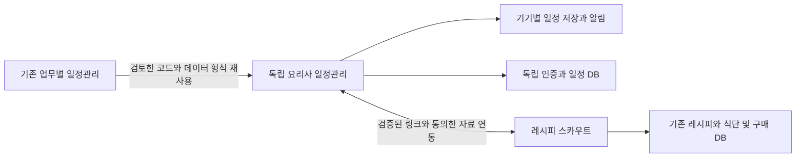

# 요리사 일정관리 데이터와 연동 설계

개발 설계 1.1의 기술 기준이다. 원본 `ai-schedule`의 기준 커밋과 재사용 결정은 [소스 검토](SOURCE_REVIEW_KO.md)에 있다. 앱 최초 공개는 1.0이며 구현 파일이나 실행 가능한 DB migration은 아니다. 업무 가이드와 영상 연계는 [별도 설계](GUIDE_AND_VIDEO_KO.md)를 따른다.

## 시스템 구조

원본 일정관리에서 새 앱으로 향하는 화살표는 개발 시 코드 재사용이다. 런타임 DB 연결이나 운영 동기화가 아니다. 새 앱에서 레시피 스카우트 DB를 직접 조회하거나 수정하지 않는다.

기본 구성은 Flutter 클라이언트, Riverpod 상태, go_router 라우트, 기기 SQLite 저장, 독립 Supabase Auth·PostgreSQL·RLS·Edge Functions와 원자 처리 RPC다. 원본 Next.js 화면과 관리자 client는 이식하지 않는다. 날짜·회차·추천의 순수 부분은 Dart와 TypeScript로 구현하고 공통 fixture로 비교한다. Firebase와 로컬 알림은 새 앱의 별도 설정을 사용한다. Flutter SDK와 라이브러리 버전은 신규 저장소의 도구 점검 후 고정하고 레시피 스카우트의 고정 Flutter 3.44.8과 package 버전은 유지한다.

## 저장소와 환경 분리

| 대상 | 소스와 자료 | 배포 경로 |
|---|---|---|
| 기존 일정관리 | 원본 저장소와 기존 DB | 기존 Vercel 프로젝트 유지 |
| 새 요리사 앱 | 새 저장소, 새 Auth·DB·Storage | 새 Android 앱과 별도 웹 도메인 |
| 레시피 스카우트 | 기존 저장소와 기존 DB | 기존 앱·웹의 별도 검토 변경 |

각 앱은 개발·시험·운영을 구분한다. CI는 개발 검사를 수행하며 운영 자격 증명에 접근하지 않는다. 사용자 자료를 개발 fixtures로 복사하지 않고 합성 자료를 사용한다. 새 앱이 레시피 스카우트 사용자 ID나 이메일만 보고 계정을 자동 연결하지 않는다.

새 저장소 기본 폴더는 `lib/core`, `lib/features/today`, `calendar`, `templates`, `tasks`, `evolution`, `connections`, `settings`, `test`, `supabase/migrations`, `supabase/functions`, `tools/dev`, `tools/release`, `docs`로 구성한다. 폴더명은 feature 이름으로 사용하고 화면 위젯에서 일정 계산이나 연동 권한을 처리하지 않는다.

## 모바일 화면과 내부 라우트

| 내부 경로 | 기능 |
|---|---|
| `/welcome` | 체험과 로그인 |
| `/today` | 오늘 업무와 완료 |
| `/calendar` | 주간 일정 |
| `/templates` | 기본과 개인 템플릿 |
| `/templates/:id` | 템플릿 상세와 버전 |
| `/plans/new` | 날짜·기준 시각·반복 입력과 미리보기 |
| `/plans/:id` | 한 번 생성한 업무 묶음 |
| `/tasks/:id` | 업무 상세와 기록 및 연결 |
| `/improvements` | 개선 제안 |
| `/guides/:id` | 업무별 사용법·확인 항목·다음 행동 |
| `/settings/connections` | 연결 앱과 해제 |
| `/settings/notifications` | 업무 알림과 상태 |
| `/settings/account` | 동기화와 계정 삭제 |

이 경로는 신규 앱에서 구현할 라우트다. 기존 사이트나 레시피 스카우트에서 현재 열리는 공개 주소가 아니다.

## 업무와 계획의 구분

템플릿은 업무의 기본 구성이다. 계획은 특정 영업일·제공 시각에 템플릿을 적용한 업무 묶음이다. 업무는 해당 계획 안에서 실제로 시작·완료하는 단위다. 반복 규칙은 미래의 계획 생성 기준이며 기존 계획을 수정하는 기능과 분리한다.

템플릿 버전은 게시 후 변경하지 않는다. 개인 수정은 새 버전으로 저장한다. 생성한 계획에는 템플릿 버전과 업무 스냅샷을 저장하므로 기본 템플릿 업데이트가 이미 확정된 업무를 바꾸지 않는다.

첨부 catalog의 schemaVersion=2는 checklist·sourceRefs·guideId를 포함하는 자료 형식이다. 각 template의 version=1은 해당 업무 구성을 처음 게시하는 버전이며 문서 개정 1.1과 별개다. 클라이언트는 지원하지 않는 schemaVersion을 적용하지 않고 업데이트 안내를 표시한다.

## 데이터 구조

표의 필드는 핵심 필드다. 모든 사용자 자료는 `id uuid`, `created_at timestamptz`, `updated_at timestamptz`와 필요한 `revision bigint`를 갖는다. 입력 UUID는 형식을 확인하고, 소유권은 인증 세션에서 판정한다.

| 자료 | 핵심 필드 | 제약과 용도 |
|---|---|---|
| workspaces | owner_id, name, timezone, business_day_boundary | 최초 1.0은 개인 작업 공간 1개, 팀은 후속 |
| workspace_members | workspace_id, user_id, role, status | 최초 owner만 생성, 후속 owner·manager·cook·buyer·viewer |
| templates | owner_workspace_id nullable, slug, name, category, published | 기본 공개 템플릿과 개인 템플릿 구분 |
| template_versions | template_id, version, schema_version, anchor_kind, task_spec jsonb | unique(template_id, version), 게시 버전 불변 |
| template_provenance | template_version_id, task_key nullable, source_repo, source_commit, source_path, source_template_id nullable, adaptation_note | 코드·업무 정의의 출처; 사용자 자료 복제와 구분 |
| template_preferences | workspace_id, template_id, selected_version, override_revision | 사용자 선택 버전과 알림 선호 |
| recurrence_rules | workspace_id, template_version_id, weekdays, timezone, local_anchor_time, anchor_day_offset, start_date, end_date, revision | DAILY 또는 WEEKLY; 기준 영업일 대비 시각의 날짜 offset 0 또는 1 |
| recurrence_exceptions | rule_id, occurrence_date, action, override_spec | unique(rule_id, occurrence_date), skip 또는 override |
| plans | workspace_id, template_version_id, rule_id nullable, occurrence_date, anchor_at, status, idempotency_key | 생성한 업무 묶음, unique(workspace_id, idempotency_key) |
| tasks | workspace_id, plan_id, template_task_key, title, planned_start_at, planned_end_at, status, postponed_until nullable, postponed_count, work_context, revision, manual_lock | 업무 분류와 소유권 분리; postponed_until은 다시 검토할 시각 |
| task_dependencies | predecessor_id, successor_id, kind | 같은 계획 안의 finish_to_start, 순환 금지 |
| task_runs | task_id, user_id, started_at, finished_at, active_seconds, duration_method, interruption_reason | 자동 측정·수동 기록 구분, 기록 삭제·수정 이력 |
| task_history | workspace_id, task_id, revision, action, actor_id, change_summary | 다른 사용자에게 개인 메모를 노출하지 않음 |
| notification_preferences | user_id, enabled, quiet_hours, lockscreen_detail, primary_device_id | 서버와 기기 알림 설정 |
| devices | user_id, installation_id, platform, push_registration, last_seen_at | push 값은 비공개, 계정 전환 시 연결 해제 |
| notification_deliveries | user_id, task_id, task_revision, reminder_at, device_id, state | unique(user_id, task_id, task_revision, reminder_at, device_id) |
| improvement_proposals | workspace_id, template_task_key, old_value, proposed_value, sample_count, method_version, state | 승인·보류·거절·적용 상태와 근거 |
| source_links | workspace_id, plan_id 또는 task_id, source_app, resource_type, resource_id, source_revision, state | 최초 일반 링크, 후속 권한 연결; FK상 대상 하나만 허용 |
| link_intents | initiator_user_id, challenge_digest, expires_at, consumed_at, state | 후속 앱 연결의 일회성 의도 기록 |
| app_connections | workspace_id, issuer, issuer_subject, local_subject, granted_scopes, state | 후속 계정 연결, 이메일로 자동 결합 금지 |
| integration_receipts | connection_id, operation_id, result_id, expires_at | 후속 재시도 중복 방지 |
| event_outbox | aggregate_id, revision, event_type, payload, available_at, attempts, state | 후속 자료 변경 통지의 전송 대기열 |
| attribution_events | consent_session_id, event_id, source_app, placement, campaign, event_type, occurred_at | 동의한 최소 이벤트, 업무 내용과 개인 메모 제외 |
| guide_catalog | guide_id, version, template_id, task_key, lesson_id nullable, destination_key, required_capability, public_steps, feature_facts | 게시 버전 불변, 기존 가이드 내용과 공개 문구의 기준 |
| guide_progress | workspace_id, user_id, guide_id, guide_version, step_key, state, evidence_kind, verified_at nullable | 사용자 체크와 서버 확인 구분; 원본 거래 변경 없음 |
| guide_video_links | guide_id, guide_version, campaign_id, content_hash, media_hash, supported_app_versions, state | 후속 관리자 자료, 회원 일정·원가와 분리 |

후속 원본 서비스에는 `partner_grants`와 `partner_event_outbox`를 새 migration으로 추가한다. 기존 migration 파일과 기존 테이블 권한은 변경 목적과 영향 검토 없이 수정하지 않는다.

원본의 `scope=public`은 ‘공적 업무’ 분류다. 새 앱에서는 `work_context=professional/personal`로 표시하고 접근은 workspace_members와 RLS로 판정한다. 최초 개인 workspace의 자료는 해당 소유자에게만 허용한다. 업무 이름·분류·가이드 진행 상태는 공개 권한을 부여하지 않는다.

### 주요 인덱스와 입력 제한

- tasks(workspace_id, planned_start_at), tasks(workspace_id, status), plans(workspace_id, occurrence_date).
- task_runs(task_id, finished_at), task_history(task_id, revision), outbox(available_at, state).
- 반복 생성은 unique(rule_id, occurrence_date)로 같은 회차를 한 번만 생성한다. 최초 구현에서는 한 규칙당 하루 한 회차다.
- 업무 제목 120자, 설명 2,000자, 계획당 50개 업무, 템플릿당 30개 업무, 선행 관계 100개를 초기 제품 제한으로 둔다.
- 업무 시간은 1~480분, 수동 메모 기록은 별도이며 0분 기록은 개선 통계에서 제외한다.
- 목록 API는 날짜 범위 최대 31일, 페이지당 최대 100개, 날짜 범위 확대는 페이지를 나눠 요청한다.
- 업무 변경은 기대 revision과 작업 UUID를 요구한다. 같은 작업 UUID와 다른 본문을 보내면 409를 반환한다.

이 제한은 성능 시험 전 기본안이다. 제품 화면과 서버에 같은 범위를 적용하고 숨은 자동 절삭을 하지 않는다.

## 일정 생성 규칙

일정 계산은 결정적인 순수 함수로 만든다. 입력은 템플릿의 정확한 버전, 기준 시각, 작업 공간 시간대, 사용자 수정, 반복 회차와 계산 알고리즘 버전이다. 동일 입력에서 같은 계산 결과가 나와야 한다.

1. 템플릿 구조, 고유 task key, 선행 관계, 시간과 반복 입력을 검사한다.
2. 선행 업무 그래프를 정렬한다. 순환하거나 같은 계획 밖의 업무를 가리키면 생성하지 않는다.
3. `anchor_at + startOffsetMinutes`를 시작으로 하고 durationMinutes를 더해 종료를 계산한다.
4. 사용자 수정이 있는 업무는 표시한 시간으로 유지한다. 선행 업무 종료 이후에 시작하지 않거나 기준 제공 시각을 넘으면 충돌 목록을 만든다.
5. 같은 담당자·장비에 겹치는 업무는 충돌 후보로 표시한다. 최초 1.0에는 담당자 1명이며 장비 최적화는 제공하지 않는다.
6. 시작이 현재보다 이전이면 지나간 업무를 표시하고 그대로 기록할지 이후로 옮길지 사용자가 선택한다.
7. 미리보기는 템플릿 버전·시간대·입력·수동 수정·계산 버전을 포함한 previewHash를 반환한다. 확정 요청의 expectedPreviewHash와 재계산 결과가 다르면 409로 다시 확인하게 한다. 사용자 확정 때만 계획과 모든 업무를 하나의 트랜잭션으로 저장한다. 하나라도 실패하면 전체 생성 실패로 처리한다.

첫 버전의 offset은 제안 시각이다. 영업시간과 휴무 입력에 따른 간단한 충돌 안내를 제공하며 주방의 실제 작업 가능성이나 조리 안전을 자동 보장하지 않는다. 완료한 업무는 새로운 계산으로 수정하지 않는다.

### 날짜와 반복 경계

업소 시간대 기본값은 Asia/Seoul이다. UTC 시각과 IANA 시간대, 사용자가 선택한 영업일을 함께 저장한다. 사용자가 자정 뒤까지 영업하면 영업일 경계 기본값 04:00을 수정할 수 있다. 화면의 영업일은 날짜별 계획 기준이며 시스템 오늘 날짜와 혼동하지 않도록 표시한다.

처음에는 반복과 자동 생성이 꺼져 있다. 사용자가 영업 요일·제공/개점 시각·마감 시각과 첫 회차를 확인한 뒤 켠다. 월~금 근무나 06:00 이후 시작을 가정하지 않는다. 05:00 준비, 자정 이후 마감, 주말 영업도 지정한 날짜·영업 구간 안에서 계산한다. 첫 출시의 주간 반복은 선택한 요일을 따르며 원본의 ‘첫 근무일’ 규칙과 구분한다. 월간 정산은 후속 monthlyRule에서 월초·월말·휴무 이동을 구조화한다.

반복의 local_anchor_time은 anchor_day_offset과 함께 저장한다. 10월 10일 영업의 다음날 01:00 마감은 occurrence_date=10월 10일, offset=1, 실제 시각=10월 11일 01:00이다. ‘오전 1시’만 받아 전날·다음날을 추측하지 않고 생성 미리보기에서 달력 날짜를 표시한다.

반복은 기기와 서버 모두 최대 14일 앞의 회차를 생성하고, 예약 알림은 7일 범위로 관리한다. 신규 기기 로그인과 앱 재개 때 범위를 보충한다. 종료일은 포함하며 휴무 예외가 일반 반복보다 우선한다. 매주 요일 선택은 해당 시간대의 달력 날짜로 계산한다. DST가 있는 시간대의 존재하지 않는 시각은 다음 유효 시각을 미리보기로 안내하고, 중복되는 시각은 앞선 오프셋을 기본으로 표시해 사용자가 확인한다.

반복 변경 메뉴는 ‘이번만’과 ‘이 날짜부터 이후’를 제공한다. 이후 변경은 새 규칙으로 나누고 이전 회차·완료 이력은 보존한다. 기존 미래 회차의 중복을 취소 표시한 후 새 회차를 생성하며 전체 변경은 재시도 식별자를 가진 원자 작업으로 처리한다. 이미 시작한 업무가 있으면 자동 대체하지 않고 검토를 요청한다.

계획·업무·회차·멱등 결과는 같은 트랜잭션으로 저장하고 취소·skip 회차는 tombstone으로 남겨 재생성을 막는다. 서버 배치는 cursor로 대상 전체를 순회하고 실패 회차만 다시 처리한다. 업무 저장과 회차 기록을 별도 upsert로 나누거나 첫 100개 대상만 반복 처리하는 원본 구현을 그대로 이식하지 않는다.

## 상태와 완료 처리

계획 상태는 draft, confirmed, cancelled, closed다. draft만 미리보기로 전체 시간을 수정할 수 있다. confirmed의 미시작 업무를 수정하면 revision을 올리고 알림을 다시 예약한다. 모든 업무가 completed, skipped, cancelled 중 하나가 되면 closed로 전환한다.

업무 상태는 pending, in_progress, completed, postponed, skipped, cancelled다. blocked와 overdue는 선행 조건과 현재 시각에서 계산하는 화면 표시이며 별도로 저장하지 않는다. pending에서 시작·미루기·건너뛰기·취소할 수 있고 in_progress에서 완료·취소할 수 있다. postponed에서 시작·다시 대기·취소·건너뛰기를 선택한다. 시작 없이 완료할 때는 실제 시간이 미기록 상태가 되며 예상값을 실제값으로 쓰지 않는다.

미루기는 postponed_count를 올리고 예정 알림을 해제한다. postponed_until이 도착하면 앱에서 재검토를 안내하며 자동 시작·자동 완료하지 않는다. 새 날짜·시간 적용은 충돌 미리보기 후 별도 revision으로 반영하고 pending으로 돌아간다. 미룬 업무가 남아 있으면 계획은 자동으로 closed가 되지 않는다.

선행 업무가 미완료면 ‘선행 확인 필요’를 표시한다. 사용자가 사유를 기록하고 진행할 수 있다. 필수 확인 단계의 강제 여부는 향후 업소 관리 기능에서 별도로 결정한다. 업무 건너뛰기는 기본적으로 후속 업무를 자동 완료하지 않는다.

완료 취소는 원래 업무로 돌아가 revision을 올리고 이력을 남긴다. 이미 지난 알림은 다시 발송하지 않는다. 계획 취소는 미완료 업무와 예약 알림을 취소하고 완료 기록은 보존한다. 업무 완료는 원본 앱의 구매·식단·재고 상태를 변경하지 않는다.

## 오프라인과 다른 기기 수정

기기는 SQLite에 계정별 일정 캐시와 변경 대기열을 저장한다. 대기열 항목은 operation_id, entity_id, expected_revision, action, payload, created_at을 가진다. 체험 자료는 로그인 자료와 별도 이름공간에 저장한다.

앱은 연결 시 서버의 cursor와 tombstone을 내려받고 대기 작업을 제출한다. 서버는 operation_id를 한 번만 처리하며 응답이 끊긴 재시도는 같은 결과를 반환한다. 현재 revision이 다르면 409와 최신 상태를 반환하고 화면에서 두 변경을 확인하게 한다. 제목·시간·상태를 마지막 저장으로 조용히 덮어쓰지 않는다.

완료와 취소가 충돌하면 서버 상태를 보여 주고 사용자가 재확인한다. 업무 이력과 실제 시간 기록은 불변 기록 추가 방식으로 중복 UUID를 차단한다. 계정 로그아웃 전 미동기화 기록이 있으면 내보내기·동기화·해당 계정의 로컬 기록 삭제를 선택하게 한다. 계정 전환 때 다른 계정의 캐시를 표시하지 않는다.

로컬 자료는 OS 앱 저장 공간과 보안 저장소를 이용하고, 토큰을 평문 설정 파일에 저장하지 않는다. 비공개 원본의 조리법·원가 자료는 후속 1.1에서도 기본적으로 오프라인 캐시에 저장하지 않는다. 연결 대상은 일반 표기로 표시하고 온라인 권한 확인 후 내용을 읽는다.

## 알림 설계

업무 시작 10분 전을 기본 제안으로 제공하고 사용자가 끄거나 바꿀 수 있다. 완료와 취소된 업무는 알림 대상에서 제외한다. 조용한 시간에는 사용자가 명시적으로 허용한 업무 알림 외에는 요약으로 보류한다. 잠금 화면 기본값은 ‘예정된 업무가 있습니다’이며 상세 제목 표시는 선택한다.

최초 1.0은 개인별 대표 알림 기기 한 대를 선택한다. 해당 기기의 로컬 알림이 주 경로이며 서버 push는 기기 동기화와 예약 갱신 안내를 맡는다. 같은 revision의 로컬 알림과 push를 두 번 표시하지 않도록 전달 ID를 사용한다. 다른 기기의 최신 변경이 오프라인 대표 기기에 도착하지 못하면 오래된 예약이 남을 수 있으므로 앱에 마지막 동기화 상태를 표시하고 서버와의 통신 성공을 알림 전달 성공으로 집계하지 않는다.

일정 수정 시 이전 revision 예약을 해제하고 새 revision만 예약한다. 재부팅, 시간대 변경, 알림 권한 변화와 로그인 전환 후 다시 조정한다. 권한이 없으면 알림 설정 안내와 앱 내부 다음 업무 표시를 유지한다.

Android 13 이상은 알림 권한을 사용자 행동 문맥에서 요청한다. 정확한 알람은 필요한 사용 사례와 권한·스토어 조건을 따로 검토하며 기본 업무 알림은 시각 지연 가능성을 안내한다. 첫 버전에는 음식 조리의 안전을 담당하는 정밀 타이머를 포함하지 않는다. [Android 알림 권한](https://developer.android.com/develop/ui/compose/notifications/notification-permission), [정확한 알람](https://developer.android.com/about/versions/14/changes/schedule-exact-alarms).

## 템플릿 개선 규칙

동일 사용자·템플릿 task key·작업 유형의 최근 20개 유효 기록에서 최소 5개가 있어야 시간 개선을 제안한다. 시작·종료가 있고 1~480분 범위이며 사용자가 장시간 중단·오입력으로 표시하지 않은 기록만 사용한다. 수동 기록과 자동 측정은 혼합 여부를 표시하고, 인분·작업 유형이 달라진 기록은 같은 집단으로 묶지 않는다.

초기 알고리즘은 중앙값을 5분 단위로 올림한 뒤 기존 값의 80~120퍼센트이면서 1~480분인 구간 안의 5분 배수 중 가장 가까운 값을 고른다. 같은 거리이면 변화량이 작은 값을 쓴다. 기존 값과 5분 이상 차이 나는 후보가 없으면 제안하지 않는다. 예를 들어 25분·중앙값 35분은 30분, 10분·중앙값 20분은 제안 없음이다. 사용자별 7일 이내 같은 제안을 다시 띄우지 않으며 경계와 입력 검사는 서버에서도 수행한다.

제안에는 sample_count, sample_window, old_value, proposed_value, method_version을 포함한다. 사용자는 다음 생성부터 적용하거나 특정 미래 계획 변경을 별도로 미리보기·확정한다. 제안 적용은 새 개인 템플릿 버전을 만들며 이전 버전 복원이 가능하다. 실제 시간이 미기록인 완료나 미루기 횟수만으로 조리법·인분·재료량을 바꾸지 않는다.

업무 매칭은 template_task_key와 버전 계보 및 작업량 구간으로 수행한다. 원본의 제목 단어 매칭을 그대로 쓰지 않고 최근 기록은 완료 시각을 기준으로 고른다. 이름이 비슷한 손질·청소나 10인분·100인분을 같은 표본으로 섞지 않는다. 최초 추천은 규칙 기반이며 자연어 해석은 후보 확인을 거친다.

## 최초 양방향 링크

공개 연결 도메인과 설치 식별자는 별도 확보 후 등록한다. 명세 안의 example.invalid는 실제 서비스가 아닌 예시다. 링크는 HTTPS와 검증된 도메인으로 제한하고 앱 설치 여부에 따라 동일한 웹 안내를 제공한다.

일정 앱의 ‘레시피 스카우트에서 준비하기’는 최초에는 기존 정상 웹 진입 주소 또는 새로 검증한 안내 화면을 연다. 기존 Firebase 설정에는 임의 경로의 새 웹 라우트를 지원한다고 가정하지 않는다. 새 공개 경로를 도입할 때 호스팅 rewrite와 OAuth 복귀 경로를 각각 시험한다.

레시피 스카우트의 ‘조리 일정 만들기’는 새 앱의 템플릿 안내와 지원하는 공개 컨텍스트만 전달한다. 공개 정보라도 URL에 메모·원가·개인 이름·회원 토큰을 넣지 않는다. 앱이 없으면 안내 화면에서 웹 체험과 설치를 선택하고 설치 후에는 사용자가 원래 링크를 다시 열어 이어갈 수 있다. 자동 설치 후 복귀는 최초 지원 범위에 포함하지 않는다.

현재 AppLinks 사용은 OAuth 콜백 처리용이다. 기존 OAuth 검증과 충돌하지 않도록 일반 업무 링크 라우터를 별도로 추가한다. 앱 시작 전후, 로그아웃 상태, 잘못된 링크, 지원하지 않는 버전, 다른 앱 계정으로의 전환을 시험한다. [Android App Links](https://developer.android.com/training/app-links/about).

## 공동 로그인과 무료회원 등록

기존 업무별 일정관리와 새 요리사 앱 회원 모두에 적용한다. 서비스별 Auth 사용자·자료는 유지하고 검증한 공통 issuer·subject를 통해 연결한다. 이용 동의 후 최초 레시피 스카우트 이동 때 정상 인증 경로를 거쳐 서버가 기존 Free 정책의 회원 이용 등록을 한 번만 수행한다. 기존 유료 이용권은 그대로 보존한다. 자세한 원본 인증 방식별 선택과 동의·탈퇴는 [회원 설계](MEMBERSHIP_KO.md)를 따른다.

회원 연결에 필요한 service_identity_links, service_consents, service_enrollments, enrollment_receipts는 각 서비스별로 접근을 제한한다. 공동 로그인 provider의 beta 여부와 현재 pinned SDK 호환성은 시험 POC로 확인한다. 운영 provider 활성화는 이 설계 작업에 포함되지 않는다.

원본의 이메일·Google·카카오 로그인과 profile은 확인됐다. 공동 로그인 서버 제공 설정은 별도 POC 대상이다. 서버가 계정 active 상태를 확인하지 못하면 연결·무료 등록을 보류하고 표시용 fallback 값으로 승인하지 않는다. 원본 계정 정지·삭제는 새 로그인과 연결 갱신을 차단하며 기존 서비스별 이용권은 해당 서비스 정책으로 별도 처리한다.

## 업무 가이드와 영상 제작 연결

업무의 template/task key로 guide_catalog를 찾고 기존 레시피 스카우트 lesson·destination에 연결한다. 최초에는 사용자 확인만 저장하고 URL 열기를 실제 업무 완료로 기록하지 않는다. 후속 원본 확인은 동의한 자료의 read-only API로 수행하며 회원권·업소 역할·grant를 함께 검사한다.

홍보 제작 자료는 승인된 공개 guide 버전과 합성 예제에서 만든다. guide_video_links는 게시 범위와 지원 버전을 표시하고 관리자가 승인한 영상만 업무 가이드에서 연다. 일정 DB와 marketing 관리자 권한은 분리한다. 영상 초안·편집·렌더링·예약은 후속 관리자 API와 기존 홍보 파이프라인의 어댑터로 구현하며 회원용 연동 API와 구분한다. 자료 계약·상태·출시 순서는 [가이드와 영상 설계](GUIDE_AND_VIDEO_KO.md)를 따른다.

## 후속 비공개 자료 연동

비공개 레시피·식단을 다루는 1.1은 별도의 계정 연결과 동의 및 원본 권한 검사를 요구한다. 두 앱의 Supabase 사용자 ID는 서로 다르다. 같은 이메일이나 표시 이름으로 연결하지 않는다. 원본 DB 키와 로그인 access token을 다른 앱으로 전달하지 않는다.

### 계정 연결과 일회성 전달

1. 요리사 앱에서 로그인한 사용자가 연결을 시작한다. 서버가 5분 유효한 intent와 고유 nonce, 클라이언트 challenge를 만든다. intent는 앱 사용자와 요청 자원, 목적 앱, 허용된 복귀 위치에 묶인다.
2. 레시피 스카우트에서는 자신의 계정으로 로그인하고 연결할 앱·요리사 계정·자료·권한·해제 방법을 확인한다. 원본 서버는 허용된 상대 서버와 통신해 intent의 사용자와 만료를 확인한다. URL에서 받은 user_id를 신뢰하지 않는다.
3. 사용자가 승인하면 원본 서버가 실제 자료 접근 권한을 다시 확인하고 제한된 partner grant를 만든다. 원가 범위는 기본 선택하지 않는다.
4. 승인 결과는 서버 간의 고정된 수신 경로에 서명된 통지로 보낸다. 서명 키, issuer, audience, 만료, nonce, jti와 허용 알고리즘을 검증한다. 승인 결과나 개인 자료 자체를 브라우저 URL에 싣지 않는다.
5. 요리사 서버는 자신의 사용자에 묶인 intent와 결과를 대조하고 한 번만 기록한다. 클라이언트가 intent 결과를 확인할 때 자신의 세션과 원래 challenge를 증명한다. 계정 변경·만료·재사용이면 거절한다.
6. 앱은 자료와 작업 템플릿의 미리보기를 표시한다. 사용자 확정 후 일정 생성 요청의 operation_id와 전달 ID로 중복 생성을 막는다.

서버 통신 키는 플랫폼 비밀 설정에 보관하고 서로의 DB service_role 키를 공유하지 않는다. 상대 서버가 주장하는 현재 사용자는 서명·고정 대상·연결된 subject와 매 요청 대조한다. 서명 구현은 검증된 라이브러리로 수행하며 직접 암호 구현을 만들지 않는다. 자료 연결 권한은 공동 로그인과 별개다. 공동 로그인과 최초 무료회원 등록은 MEMBERSHIP_KO.md의 인증 흐름을 먼저 완료한다.

### 원본 권한과 연동 범위

범위는 recipe.reference.read, meal.reference.read, purchase.reference.read, chef_cost.reference.read로 나눈다. 첫 연동은 recipe와 meal부터 구현하고 구매·원가는 실제 필요와 기존 권한에 맞춰 확장한다. 모든 응답에서 원본 소유권·업소 역할·회원권·grant 상태를 다시 검사한다.

‘준비 일정 생성 허용’은 일정 앱에 업무를 만드는 권한이다. 원본 레시피 수정, 식단 확정, 구매 승인, 재고 차감 권한을 주지 않는다. 일정 앱에서 원본 수정이 필요하면 해당 앱 화면으로 이동하고 원본 권한으로 처리한다.

연결 해제는 양쪽 UI에서 가능하다. 해제 즉시 서버 읽기를 거절하고 상대 앱의 연결을 revoked로 표시한다. 원본 사용자 삭제·업소 접근 해제·회원권 변경 시 유효성 검사를 다시 수행한다. 이미 사용자가 직접 내보낸 파일을 원격 회수한다고 약속하지 않는다. 권한 없는 자료 제목은 화면과 잠금 알림에 계속 노출하지 않는다.

### 원본 버전과 변경 통지

연결에는 resource_type, resource_id, source_revision을 저장한다. 원본 내용은 일정 앱에서 기준 자료로 수정하지 않는다. 변경 시 resource_changed 이벤트를 받아 stale로 표시한다. 식단 날짜·인분이나 준비 시간에 영향이 있으면 변경 전후와 영향을 받는 미완료 업무를 미리보기로 표시하고 사용자 확인 후 수정한다.

원본이 삭제되거나 접근이 해제되면 linked_resource_unavailable로 표시한다. 독립적인 업무·완료 기록은 유지하고 새 자료 연결을 제안한다. 이벤트를 놓쳤을 때 업무 상세 열기와 앱 재개 때 온라인 재조회로 복구한다.

웹훅은 HTTPS, 허용된 issuer, 서명, audience와 5분 재전송 허용 시간, event_id 고유성을 검사한다. 업무 내용과 회원 토큰을 로그에 넣지 않는다. outbox 작업은 최대 8회 지수 백오프 후 검토 상태로 보내고 재시도 한도를 넘었다고 사용자 자료를 삭제하지 않는다. 웹훅 payload와 서버 응답은 직접 실행할 지시가 아닌 검증 대상 자료다.

## API 계약

첨부 OpenAPI는 후속 연동 설계다. 공개 앱 배포에 이미 사용할 수 있는 API를 뜻하지 않는다. 새로운 기능의 버전과 operation_id를 응답에 포함하고 잘못된 입력은 부작용 없이 거절한다.

| API | 호출 주체 | 목적 |
|---|---|---|
| GET /v1/templates | 공개 또는 앱 사용자 | 게시된 템플릿과 정확한 버전 조회 |
| POST /v1/plans/preview | 일정 앱 사용자 | 일정 계산과 충돌 표시, 저장 없음 |
| POST /v1/plans | 일정 앱 사용자 | operation_id로 한 번 생성 |
| PATCH /v1/tasks/{id} | 일정 앱 사용자 | 기대 revision으로 시간·상태 변경 |
| POST /v1/recurrences | 일정 앱 사용자 | 최초 1.0 반복 규칙 생성 |
| PATCH /v1/recurrences/{id} | 일정 앱 사용자 | 이번 회차 또는 이후 규칙 분리 |
| GET 및 POST /v1/sync | 일정 앱 사용자 | 변경 조회와 대기 작업 처리 |
| POST /v1/improvements/{id}/apply | 일정 앱 사용자 | 승인한 개인 템플릿 개선 적용 |
| POST /v1/link-intents | 일정 앱 사용자 | 후속 연결 의도 생성 |
| GET /v1/link-intents/{id} | 원래 요청 사용자 | challenge 증명 후 자신의 연결 결과 확인 |
| POST /v1/partner/consents | 원본 앱 사용자 | 후속 상대 계정과 자료를 확인해 동의 |
| POST /v1/partner/references | 허용된 상대 서버 | 후속 grant와 현재 사용자·원본 권한 검증 후 자료 읽기 |
| POST /v1/integration/events | 허용된 상대 서버 | 서명·중복 검증 후 이벤트 수신 |
| POST /v1/service-enrollments | 레시피 스카우트 사용자 | 최초 1.0 무료회원 등록과 기존 이용권 보존 |
| DELETE /v1/connections/{id} | 연결한 앱 사용자 | 후속 연결 해제 |

일정·반복·동기화·개선 API는 독립 일정 앱 API다. 최초 체험 모드에서는 같은 입력·출력 모델을 로컬에서 처리한다. 실제 서버 구현은 Edge Function과 내부 RPC로 나누되 공개 API 계약을 유지한다.

오류 코드는 400 INVALID_INPUT, 401 AUTH_REQUIRED, 403 PERMISSION_DENIED, 404 RESOURCE_UNAVAILABLE, 409 REVISION_CONFLICT 또는 IDEMPOTENCY_MISMATCH, 410 INTENT_EXPIRED, 422 SCHEDULE_CONFLICT, 429 RATE_LIMITED, 503 SOURCE_UNAVAILABLE다. 공개 오류에서 타 업소·다른 사용자의 존재 여부를 노출하지 않는다. request_id는 자격 증명이 아니며 지원 문의와 이력 추적에만 사용한다.

권장 시간 제한은 원본 읽기 10초, 같은 멱등 요청의 사용자 재시도 최대 3회다. 서버가 생성 여부를 확정하지 못했을 때는 같은 operation_id로 상태를 확인하고 새 ID로 다시 만들지 않는다. 입력 제한과 rate limit은 사용자·workspace·연동 상대별로 적용한다.

## 권한과 데이터 수명

최초 앱은 owner가 자신의 workspace 자료만 접근한다. 팀 버전에서는 owner가 회원·권한을 관리하고 manager가 업무 배정·템플릿 게시, cook과 buyer가 배정 업무 실행, viewer가 허용 자료 조회를 맡는다. 업무 메뉴 선택은 권한을 부여하지 않는다.

모든 노출 테이블에는 RLS와 역할별 grants를 함께 적용한다. 클라이언트 직접 쓰기는 필요한 테이블만 허용하거나 검증된 RPC로 제한한다. SECURITY DEFINER를 사용하는 함수는 고정 search_path, 명시적 현재 사용자·workspace 검증과 호출 grants를 둔다. service_role은 서버에만 보관한다. [Supabase RLS](https://supabase.com/docs/guides/database/postgres/row-level-security).

초기 제품 보존안은 사용자 일정·기록은 삭제 요청 전까지, 개인 개선 표본은 최근 20개 유효 기록, 동의한 분석 원시 이벤트는 90일, 최소 보안 로그는 30일이다. 배포 전 개인정보 안내와 실제 기술 구현이 같은지 확인한다. 집계 자료도 재식별할 수 있으면 개인 자료로 취급한다.

계정 삭제는 앱 설정과 웹에서 신청할 수 있게 한다. 본인 확인 후 연동 grant, 세션, push 등록, 분석 식별 연결을 우선 폐기하고 관련 일정·개인 템플릿을 30일 이내에 삭제하는 운영 목표를 둔다. 백업은 접근 차단 상태로 최대 30일의 보관 주기에 따라 소멸시키며 복구 시 삭제 목록을 재적용한다. 이 기간은 제품 운영안이며 법률상 의무 기간의 단정이 아니다.

공동 업무를 도입하기 전 workspace 소유권 이전과 회원 탈퇴 자료의 보존·표시 정책을 별도로 완성한다. 서비스별 이용 자료는 별도다. 공동 로그인 주체와 서비스 탈퇴의 관계는 MEMBERSHIP_KO.md를 따른다. 한 서비스만 탈퇴하면 다른 서비스 이용은 유지하고 해당 자료 연결 grant를 해제한다. 공통 로그인 주체 삭제 요청은 영향받는 서비스와 자료 범위를 확인한 뒤 처리한다. [Google Play 계정 삭제](https://support.google.com/googleplay/android-developer/answer/13327111).

## 양방향 사용 측정

이벤트는 template_viewed, plan_confirmed, task_completed, cross_app_clicked, destination_opened, destination_first_action, connection_approved, improvement_accepted로 제한한다. event_id로 중복을 제거하고 source_app은 general_scheduler, chef_planner 또는 recipe_scout, placement와 campaign은 허용 목록만 사용한다.

개인 업무 내용, 레시피 제목·ID, 이메일, 금액·원가, 자유 입력 URL이나 메모를 분석 payload로 보내지 않는다. 앱 간 상관 ID는 사용자 동의 후 발급한 짧은 유효기간의 무작위 click_id로 처리하고 consent session에 묶는다. 업무 연결 intent와 마케팅 식별자는 서로 다른 자료다.

| 지표 | 계산 정의 |
|---|---|
| 양방향 버튼 사용률 | 방향별 동의 사용자 중 버튼을 누른 고유 사용자 / 해당 버튼을 본 고유 사용자 |
| 도착 확인률 | click_id별 destination_opened / cross_app_clicked |
| 첫 유효 행동률 | 도착 후 24시간 안의 첫 일정 확정 또는 레시피 저장·구매 준비 / 도착 확인 |
| 가입 유입 | 도착 후 7일 안에 가입하고 동의한 연결 증거가 있는 사용자, 클릭과 별도 보고 |
| 주간 재방문 | 첫 유효 행동 사용자 중 7일 안의 다른 날짜에 다시 핵심 행동한 사용자 |

가입·설치 자동 연결 근거가 없으면 미확인으로 남긴다. 동의하지 않은 사용자는 이벤트 연결 집계에서 제외하고 모집단과 동의 비율을 함께 보고한다. 적은 표본으로 전체 시장 전환율을 단정하지 않는다.

## 장애와 운영

| 상황 | 사용자 화면 | 내부 처리 |
|---|---|---|
| 인터넷 없음 | 저장 대기와 마지막 동기화 | 로컬 변경 대기열, 온라인 복구 |
| 원본 앱 API 장애 | 연결 자료를 잠시 확인할 수 없음 | 일정 실행은 유지, 제한된 재시도 |
| 같은 업무 동시 수정 | 다른 기기의 변경과 비교 | 409, 자동 덮어쓰기 금지 |
| 원본 자료 변경 | 새 버전 확인 | stale 상태와 변경 미리보기 |
| 링크 만료 | 연결을 다시 시작 | 이미 생성된 계획 중복 방지 |
| 알림 권한 없음 | 알림 설정 안내와 다음 업무 | 일정 기능 유지 |
| 새 빌드 오류 | 운영 지원 안내 | 승인된 동일 앱·환경의 검증 빌드로 복구 |

기능별 플래그는 independent_schedule, cross_app_public_links, private_reference_links, evolution_suggestions, team_workspaces다. 특정 연동을 끄더라도 독립 일정과 이미 만든 업무를 유지한다. 운영 모니터는 오류율·동기화 지연·중복 거절·연동 만료·알림 권한 상태를 수집하고 업무 내용은 수집하지 않는다.

일정 데이터 백업의 초기 복구 목표는 하루 이내 자료 시점과 4시간 이내 서비스 복구다. 선택한 요금제·백업 기능과 실제 복구 시험으로 달성 여부를 확인하고 운영 목표를 확정한다. 백업 파일과 운영 복구 토큰을 Git에 저장하지 않는다.
