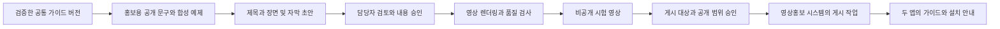

# 업무 가이드와 영상홍보 연계 설계

일정관리 앱이 레시피 스카우트의 사용 가이드 역할을 맡는다. 오늘의 업무에 맞춰 필요한 기능과 확인 순서를 안내하고, 승인한 공통 가이드 내용으로 홍보 영상을 제작한다. 새 요리사 앱에서는 핵심 기능으로 제공하며 기존 업무별 일정관리에는 식당 업무를 선택한 사용자에게 선택형으로 추가한다.

레시피 스카우트에는 이미 `/guide`의 사용자별 수업과 구매·공급업체 실습이 있다. 설명과 예제의 기준은 이 가이드에 두고 일정관리에는 ‘언제 무엇을 해야 하는지’를 연결한다. 레시피 스카우트에는 ‘이 실습을 업무 일정으로 만들기’, 일정관리에는 ‘사용법 보기·실제 기능 열기’를 제공한다. 같은 내용을 두 앱에서 따로 편집하지 않는다.

## 사용자가 보는 업무 안내

각 업무 상세에는 **해야 할 일 → 이유 → 확인 항목 → 사용법 보기 → 기능 열기 → 다음 업무** 순서로 표시한다. 첫 화면에는 다음 행동 하나를 우선 보여 주고 익숙한 사용자는 설명을 접을 수 있다. 안내를 읽거나 링크를 연 것만으로 실제 업무가 완료되지는 않는다.

| 일정관리 업무 | 레시피 스카우트에서 안내할 행동 | 완료 확인 |
|---|---|---|
| 오늘 메뉴 준비 | 레시피 찾기, 초안 검토, 저장한 레시피 확인 | 1.0 사용자 확인; 후속에는 허용된 저장 결과 조회 |
| 메뉴와 인분 확정 | 업소 식단에서 메뉴·인분·제공일 확인 | 원본 식단 상태를 후속 권한 API로 확인 |
| 필요한 재료 준비 | 장보기 예제 또는 업소 구매 준비 | 개인 장보기와 업소 구매 경로를 구분 |
| 발주 전 검토 | 구매량·구매 후보·구매요청 사용법 | 원본의 별도 승인, 자동 주문 없음 |
| 납품 확인 | 수량·품질 확인과 입고 기록 사용법 | 원본 입고 결과와 체크리스트 완료를 구분 |
| 신메뉴 검토 | 표준 레시피·인분·원가 사용법 | 회원권과 업소 역할 확인 후 기능 열기 |
| 다음날 준비 | 남은 재료 확인, 다음 식단·일정 계획 | 다음 업무 미리보기 후 사용자가 확정 |

무료회원에게는 이용 가능한 레시피·장보기 기능과 예제 학습을 안내한다. 업소·원가 기능의 실제 실행은 기존 회원권·역할을 따른다. 이용 권한이 없으면 사용법·샘플 체험과 필요한 조건을 표시하고 무료 연결만으로 유료 권한이 생겼다고 안내하지 않는다.

## 가이드 데이터와 진행 상태

`guide_catalog`는 guide ID, 버전, 업무 목적, 연결 template/task key, lesson ID, 확인 항목, destination key, 필요한 권한, 검증한 앱 버전과 공개 가능 문구를 가진다. 실제 URL은 앱별 등록된 destination resolver가 만들며 자유 입력 URL이나 비공개 자료 ID를 public catalog에 넣지 않는다.

공통 설명·예제는 레시피 스카우트 담당자가 관리하고 업무 연결은 요리사 앱 담당자가 관리한다. 기존 Dart 가이드 정의에서 공개 catalog를 내보내는 빌드 어댑터를 만들고 버전·해시가 있는 게시본을 두 앱에 포함한다. 새 앱은 공개 게시본을 읽으며 원본 DB를 공동 사용하지 않는다. 초기 연결은 `/guide`와 검증한 lesson 경로만 지원하고 임의 deep link를 현재 주소로 가정하지 않는다.

`guide_progress`는 workspace·사용자·guide version·step key별로 저장한다. 단계 상태는 not_started, viewed, user_confirmed, verified, unavailable로 구분하고 `evidence_kind`와 확인 시각을 함께 기록한다. ‘직접 확인함’과 ‘원본에서 확인됨’을 다른 표시로 제공한다. 단계 체크와 업무 완료, 식단 확정·구매 승인·입고는 서로 다른 상태다.

1.0에서는 공개 설명·기존 가이드 진입·사용자 체크리스트·다음 일정 제안을 제공한다. 개인 진행 상태만 저장하며 레시피 스카우트의 내부 자료를 자동 읽지 않는다. 1.1에서는 사용자가 연결한 자료에 한해 서버가 권한을 확인하고 read-only 결과로 verified 상태를 제안한다. 권한 해제·자료 삭제·버전 변경 때에는 재확인이 필요한 상태로 바꾸며 원본 업무 상태를 자동 수정하지 않는다.

원본 일정관리의 기존 시설관리·개인 업무에는 요리 가이드를 강제 표시하지 않는다. 식당 pack에서 선택한 업무에만 안내 키를 추가하고 기본 일정 화면·기존 DB 자료를 유지한다. 새 앱의 일정·알림·오프라인 기능은 안내 서버 장애 때에도 계속 사용할 수 있다.

## 영상 제작 흐름

일정 업무는 ‘무슨 내용을 설명할지’의 후보가 된다. 홍보 작업은 별도 관리자 공간에서 수행하며 일반 회원의 업무 완료 이벤트만으로 영상 생성·AI 비용·업로드를 실행하지 않는다. 담당자가 승인한 공개 catalog에서 영상 제작 작업을 만든다.

공통 콘텐츠는 목적, 실제 사용 단계, 확인 사항, 짧은 효과 설명, 두 앱의 연결 행동을 갖는다. 앱 가이드는 자세히 설명하고 영상은 핵심 행동 1~2개를 추린다. 게시한 영상은 관련 업무의 ‘짧은 사용법 영상’에서 다시 볼 수 있게 해 홍보와 학습을 연결한다.

## 현재 영상홍보 기능과 추가 개발

기준은 레시피 스카우트 사무실 개발 브랜치의 `marketing_generate`, `tools/marketing/render.py`, `worker.mjs`와 [홍보 기능 검토](https://github.com/guige01-guinsa/kyoutube/blob/ca33c0afb77930a994bce13544a243c1cec7b1bd/docs/MARKETING_READINESS_REVIEW_KO.md)다. 현재 복구한 운영 웹·기존 v99에서 새 관리자 화면의 전체 사용 흐름은 별도 검수 대상이다.

| 기능 | 확인한 현재 범위 | 이번 연계의 추가 개발 |
|---|---|---|
| 초안 생성 | 영상 검색·장보기·보유 재료 검색 3개 고정 주제 | 승인된 guide ID·버전·feature fact 목록 입력 |
| 장면 | 제목·설명·문자열 장면 3개 | guide 버전·출처·목적 앱·콘텐츠 해시 저장 |
| 영상 | 720×1280, 3장면×8초, 24초 세로 무음 카드 | 1단계 그대로 재사용, 문구 넘침·링크 안내 검사 |
| 수정 | 관리자 생성·예약·취소; 초안 편집 UI 없음 | 문구 편집·검토·변경 시 승인 무효화 |
| 안내 링크 | Recipe Scout Android 링크와 고정 마지막 장면 | 앱별 destination allowlist와 양방향 안내 페이지 |
| 게시 | 관리자 2단계 인증·승인, YouTube worker, 불확실한 업로드 보류 | 검토된 영상 해시·채널·공개 범위를 작업에 고정 |
| 성과 | 조회·좋아요 | 동의한 가이드 도착·첫 유효 행동과 구분 측정 |
| 화면·음성 | 이 파이프라인에는 화면 녹화·음성·음악 없음 | 후속 30~60초 튜토리얼, 합성 계정 화면과 승인된 음성 |

저장소의 `marketing_video_draft`는 별도의 장면·내레이션 초안 코드다. `marketing_generate`의 문자열 3장면과 형식이 다르므로 바로 같은 렌더러에 넣을 수 없다. 초기에는 현재 검증 대상인 24초 카드 파이프라인 하나를 사용한다. 음성·실제 화면 영상은 별도 renderer와 파일·음성 길이·자막 검사까지 구현한 뒤 제공한다.

현재 worker는 Recipe Scout 이름·설치 링크를 사용한다. 새 요리사 앱 홍보를 넣으려면 브랜드·확보된 앱 주소·CTA를 허용 목록으로 선택하는 확장이 필요하다. 아직 출시하지 않은 앱의 설치 버튼이나 앱 간 자동 연동 기능을 현재 제공한다고 영상에 쓰지 않는다. 비공개 게시 설정과 공개 게시 전 검토는 유지한다.

## 제작 계약과 작업 상태

가이드에서 홍보로 넘기는 자료는 `guideId`, `guideVersion`, `sourceCommit`, `publicFeatureFacts`, `publicSteps`, `targetApps`, `locale`, `format`, `approvedAssetIds`, `contentHash`, `operationId`다. 사용자 이름·일정 ID·식단 ID·업소 매출·원가·납품 자료·사용자 원본 사진·계정 토큰은 제외한다. 문구와 영상에 쓸 화면은 합성 시험 계정 또는 별도 이용 허락을 받은 자료로 만든다.

첫 자료와 3장면 초안은 [guide-video-brief.v1.json](guide-video-brief.v1.json)에 있다. 새 어댑터가 서버에서 contentHash와 operationId를 확정하며 예시 JSON 자체는 생성 요청이나 게시 승인이 아니다.

sourceCommit은 가이드 콘텐츠를 게시한 실제 커밋이며 일정관리 원본의 기준 커밋과 혼용하지 않는다. 예시에는 두 저장소의 sourceBaselines와 확인한 기능의 출처를 넣고 아직 게시하지 않은 guide catalog의 sourceCommit은 비워 둔다. 제작 요청을 확정할 때에는 게시된 정확한 버전·커밋·해시가 모두 있어야 한다.

내부 관리자 API의 개발안은 `POST /v1/admin/guide-video-drafts`, `PATCH /v1/admin/guide-video-drafts/:id`, `POST /v1/admin/guide-video-drafts/:id/render`, `POST /v1/admin/guide-video-drafts/:id/approve`다. 예약은 기존 홍보 승인 절차에 어댑터로 연결한다. 이 API는 신규 개발 대상이며 기존 함수나 공개 회원 연동 OpenAPI의 운영 endpoint가 아니다.

홍보 상태는 draft → content_reviewed → rendering → ready → private_tested → approved → scheduled → processing → uploaded로 구분한다. 실패는 failed, 업로드 결과 불확실은 needs_review다. 앱 내부 상태 uploaded는 YouTube 영상 ID를 확인했다는 의미로, 공개 홍보 여부는 실제 privacy와 승인 기록으로 따로 표시한다. 기존 DB가 published라는 이름을 쓰더라도 사용자에게 공개 여부를 추정해서 보여 주지 않는다.

승인은 콘텐츠 해시·영상 해시·가이드 버전·채널·목적 앱·공개 범위·예약 시각에 묶는다. 승인 후 문구·링크·자산·영상이 바뀌면 승인을 무효화한다. UUID 재시도는 같은 제작 결과로 이어지고 응답 손실로 새 영상 작업을 만들지 않는다. 기존 worker의 불확실한 업로드 자동 재전송 금지를 유지한다.

기존 worker는 예약한 초안에서 영상을 만든다. 해시로 승인하려면 먼저 렌더링한 파일을 관리자 전용 Storage에 보관하고 수정 불가한 media ID로 승인하는 경로를 추가해야 한다. 게시 worker는 승인한 파일의 해시를 확인해 업로드하며 승인 후 새로 렌더링해서 파일을 바꾸지 않는다.

## 첫 제작 주제

| 순서 | 가이드 주제 | 짧은 영상 구성 | 안내 목적 |
|---|---|---|---|
| 1 | 영업 전 재료 확인 | 준비할 업무 → 보유 재료로 레시피 찾기 → 실제 이용 안내 | 레시피 스카우트 첫 사용 |
| 2 | 레시피에서 준비 일정 만들기 | 요리 선택 → 제공 시각과 업무 확인 → 일정 앱 안내 | 요리사 앱 출시 후 양방향 유입 |
| 3 | 다음날 메뉴 준비 | 메뉴 검토 → 장보기 목록 → 다음 준비 업무 | 두 앱의 반복 사용 |
| 4 | 구매요청 사용법 | 수량 검토 → 요청 확인 → 승인 권한 안내 | 권한이 있는 업소 사용자 학습 |

한 편에서 두 앱의 모든 기능을 설명하지 않는다. 해당 업무의 다음 행동 하나를 명확히 보여 주고 끝에 두 앱의 연결 안내를 둔다. 날짜별 회원 일정을 읽어 매일 영상을 자동 생산하는 방식은 초기 범위에 넣지 않는다.

## 추가 개발 순서와 검수

업무 가이드 기본형은 최초 1.0에 포함한다. 공통 가이드 catalog·업무 연결·권한별 안내를 먼저 만들고 같은 승인 콘텐츠로 24초 영상 초안과 렌더링을 연결한다. 영상 연계는 일정 앱 1.0의 핵심 동기화·회원 POC와 분리해 1.1의 첫 확장으로 진행한다. 핵심 앱 10~14주 계획에 영상 자동화를 모두 포함하지 않는다.

24초 카드 연계는 기존 파이프라인의 정상 동작과 관리자 접근이 검증된 뒤 추가 **2~3주**를 계획 범위로 둔다. 화면·음성·자막을 넣은 30~60초 튜토리얼은 추가 **3~5주**를 우선 추정하고 샘플 1편의 제작·검수 결과로 다시 산정한다. 이는 담당 개발자 1명 기준의 초기 추정이며 확정 견적이 아니다.

필수 검수는 기존 가이드의 실제 기능 도착, 무료·유료·업소 권한별 안내, 구버전 콘텐츠 차단, 개인정보 없는 공개 자료, 편집 후 승인 해제, 중복 제작 방지, 문구 넘침과 재생 시간, 올바른 채널의 비공개 업로드, 불확실한 업로드 보류다. 이후 공개 게시와 앱 화면의 영상 연결을 별도로 확인한다.

가이드 개정 때 연결 영상은 최신·구버전·교체 예정으로 표시한다. 지원 기능과 무료 범위가 달라진 영상은 신규 유입에서 숨기고 새 가이드 버전으로 교체한다. 조회수와 실제 가입·업무 이용을 같은 성과로 집계하지 않는다.
