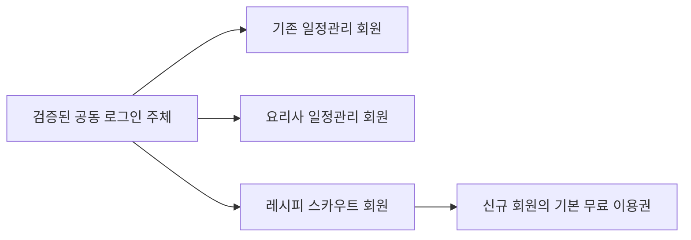

# 일정관리 회원의 레시피 스카우트 무료 이용 설계

적용 대상은 **기존 업무별 일정관리 회원과 새 요리사 일정관리 회원 모두**다. 두 서비스의 기존 업무와 자료를 유지하면서 레시피 스카우트 무료 이용 경로를 제공한다. 회원 연결은 최초 공개 범위이며 비공개 레시피·식단·원가 자료 공유는 별도 후속 기능이다.

## 권장 회원 방식

권장안은 **공동 로그인과 첫 이용 시 무료회원 등록**이다. 가입이나 연결 화면에서 레시피 스카우트 이용 조건을 확인하고 동의한 회원은 처음 레시피 스카우트로 이동할 때 가입 양식을 다시 작성하지 않는다. 서버가 인증된 공통 주체를 확인해 레시피 스카우트의 서비스 이용 등록을 한 번만 만든다.

| 방식 | 사용자 경험 | 판단 |
|---|---|---|
| 일정관리 가입 때 모든 회원을 즉시 일괄 생성 | 레시피 스카우트를 사용하지 않아도 계정과 자료가 생김 | 선택하지 않음 |
| 연결 버튼에서 매번 별도 회원가입 | 연결 효과가 약하고 비밀번호 관리 부담이 생김 | 기본안으로 쓰지 않음 |
| 한 번 동의하고 최초 이용 때 자동 무료 등록 | 별도 가입 입력을 줄이고 실제 이용 회원만 활성화 | 권장 기본안 |

여기서 자동은 동의한 사용자에게 등록 양식을 반복하지 않는다는 뜻이다. 최초 인증·약관 확인·필요한 계정 연결을 생략하지 않는다. 홍보 알림 동의는 무료회원 이용 동의와 분리하고 선택 해제가 기본 기능 이용을 막지 않는다.

## 신규 회원과 기존 회원의 흐름

### 기존 일정관리 회원

기존 서비스의 설정 또는 관련 업무 화면에 ‘레시피 스카우트 무료회원으로 이용’을 추가한다. 일정관리 세션을 확인하고 공동 로그인 주체와 연결한다. 레시피 스카우트 이용 조건과 필요한 정보 전달에 동의하면 무료 이용 등록을 진행한다. 회원은 원래 일정과 자료를 계속 사용할 수 있다.

### 새 요리사 앱 회원

가입 단계에서 새 앱 이용 동의와 레시피 스카우트 공동 이용 선택을 구분한다. 사용자가 선택하면 동의 기록을 남기고, 첫 레시피 스카우트 이동 때 무료회원 이용 등록을 완료한다. 선택하지 않은 회원도 나중에 연결 화면에서 신청할 수 있다. 체험 모드는 먼저 계정을 만들거나 기존 계정에 로그인해야 서비스 회원 연결을 사용할 수 있다.

### 이미 레시피 스카우트를 사용하는 회원

기존 계정 로그인을 통한 연결을 기본으로 안내한다. 기존 레시피·업소·구매 자료와 무료 또는 유료 이용권을 그대로 보존한다. 두 서비스에서 서로 다른 이메일을 사용해도 양쪽 계정의 인증을 완료하면 연결할 수 있다. 같은 이메일만 보고 앱 코드가 두 사용자 자료를 합치지 않는다.

일부 인증 플랫폼에는 검증된 동일 이메일의 identity 자동 연결이 있다. 이 플랫폼 동작은 시험 환경에서 기존 계정과 미검증 이메일 사례까지 확인한다. 직접 SQL로 auth 사용자나 회원 자료를 합치는 기능은 만들지 않는다. 연결 완료 전 계정 이름과 기존 이용 상태를 사용자가 확인하도록 한다.

## 로그인 주체와 서비스 회원의 분리

하나의 로그인 주체가 있어도 각 서비스는 자신의 사용자 ID와 서비스 자료를 관리한다. 인증되었다는 사실과 서비스 이용권, 업소 권한, 자료 공유 동의를 서로 다른 값으로 처리한다.

서비스별 회원권은 독립적이다. 일정관리 유료 회원이라도 레시피 스카우트 고급 기능이 자동으로 유료 권한이 되는 것은 아니다. 향후 공동 상품을 만들면 가격·권한·구매 복원·탈퇴 규칙을 별도로 설계한다.

## 확인된 원본 인증과 공동 로그인 선택

원본 `ai-schedule`은 Supabase Auth의 이메일·Google·카카오 로그인과 사용자별 profile을 사용한다. 기준 커밋과 파일은 [소스 검토](SOURCE_REVIEW_KO.md)에 있다. 현재 로그인 버튼은 외부 제공자로 로그인하는 기능이며 다른 앱에 로그인을 제공하는 OIDC 서버 활성화가 확인된 것은 아니다.

| 원본 인증 상태 | 선택 방향 | 원본 영향 |
|---|---|---|
| 이미 검증된 OIDC 제공 기능 있음 | 원본의 로그인 주체를 두 앱에서 공식 provider로 이용 | 상대 앱 등록과 회원 연결 진입점 |
| Supabase Auth 사용 확인 | 원본 Auth를 후보 provider로 삼아 OAuth 서버·Custom OIDC·고정 SDK를 시험 | 인증 제공 기능과 동의 UI, 업무 로직 유지 |
| 로그인 제공 기능 없음 | 별도 공동 로그인 provider 도입과 기존 회원의 인증된 계정 연결 | 기존 비밀번호·회원 DB 이전 없이 단계적 연결 |

레시피 스카우트는 기존 Supabase Auth의 사용자와 권한을 유지하고, 검증한 공동 로그인 제공자를 추가하는 방향을 우선한다. 외부 로그인으로 얻은 원본 세션을 상대 서비스 API access token처럼 사용하지 않는다. 각 서비스가 자신의 정상 세션을 발급한다.

Supabase는 OAuth 2.1과 OIDC 서버 및 Custom OAuth/OIDC provider를 공식적으로 문서화하고 있다. OAuth 서버는 문서상 beta이므로 현재 프로젝트 지원, SDK 호환성, issuer와 discovery 경로, 기존 로그인·MFA·복구·identity 연결을 POC에서 확인한다. 확인 전 운영 provider를 활성화하지 않는다. [OAuth 서버 시작](https://supabase.com/docs/guides/auth/oauth-server/getting-started), [Custom provider](https://supabase.com/docs/guides/auth/custom-oauth-providers).

POC가 통과하지 않으면 외부 공동 로그인 provider를 비교해 선택하고 추가 비용·운영 의존성과 구현 기간을 다시 산정한다. 운영 일정을 맞추기 위해 비밀번호·기존 로그인 토큰·DB 키를 공유하는 우회 방식을 만들지 않는다.

시험은 원본 프로젝트의 OAuth 서버 제공 여부, OIDC용 비대칭 서명과 JWKS, 서비스별 custom provider, 기존 회원 수동 identity linking을 포함한다. provider 변경이나 SDK 업그레이드를 검수 없이 진행하지 않는다. 원본 Auth → 상대 서비스 Auth → 모바일 callback의 두 단계 PKCE와 계정 선택을 실제 기기에서 확인한다. 고정 SDK가 custom provider를 지원하지 않으면 그 결과를 근거로 호환 경로·변경 범위·기간을 다시 결정한다.

원본 profile 조회의 표시용 fallback은 회원 연결 승인 근거로 사용하지 않는다. 서버에서 원본 계정 상태를 확인하고 active일 때만 새 연결을 허용한다. 조회 실패는 보류, suspended·withdrawn은 거절한다. 계정 정지·삭제를 확인할 수 있는 서버 계약과 갱신 시점을 POC의 필수 결과로 남긴다.

## 표준 인증 흐름

OAuth authorization code와 PKCE, 정확한 redirect allowlist, state와 OIDC nonce를 사용한다. 대상·발급자·서명·만료를 검증하고 공통 주체는 `(issuer, subject)`로 식별한다. 이메일과 표시 이름은 식별자 대신 표시·연락 정보로 취급한다.

공동 로그인 provider의 등록된 클라이언트만 허용한다. 개발·시험·운영 client ID와 callback은 분리한다. 모바일과 웹의 두 PKCE 구간 및 platform callback을 혼동하지 않도록 실제 SDK 동작을 기록한다. client secret은 서버에만 두고 앱 번들에 포함하지 않는다.

기존 사용자는 먼저 레시피 스카우트의 기존 계정으로 로그인한 뒤 지원하는 identity linking 절차를 수행한다. 인증 플랫폼의 자동 연결 동작과 수동 연결 지원 범위는 별도 시험 항목이다. [Supabase identity linking](https://supabase.com/docs/guides/auth/auth-identity-linking).

회원 연결은 개인정보 공유 범위를 name과 검증된 로그인 주체의 필요한 최소 정보로 제한한다. email이 필요한 경우 목적을 설명하고 제공자 검증 상태를 확인한다. 생일·휴대폰·주소·사업자 정보·일정 내용·레시피·결제 내역은 무료회원 등록에 포함하지 않는다.

## 무료 이용권 등록과 중복 방지

1. 인증 플랫폼에서 원본 공동 로그인 identity를 검증하고 서비스 세션을 발급한다.
2. 레시피 스카우트 서버가 현재 서비스 사용자와 공동 주체, 이용약관 동의의 유효성을 확인한다.
3. 기존 서비스 회원이면 회원 상태와 이용권을 조회하고 변경 없이 연결한다.
4. 새 회원이면 기존 Free 정책에 따른 서비스 profile과 무료 이용 상태를 한 번만 등록한다.
5. 이용 등록 결과와 기존 자료 유지 여부를 보여 주고 요청한 화면으로 이동한다.

등록의 unique key는 service와 service_user_id 및 연결한 issuer·subject다. 동시 로그인과 통신 재시도에서 같은 이용권을 중복 생성하지 않는다. 신규 무료 등록은 유료 이용권을 UPDATE하거나 0원 구매·유료 결제 영수증을 생성하는 방식으로 처리하지 않는다.

무료 범위는 기존 레시피 스카우트의 서버 회원권·AI 한도 정책을 그대로 사용한다. 클라이언트가 보낸 `plan=free` 또는 `is_schedule_member=true`만으로 이용권을 등록하지 않는다. 멤버십 함수와 기존 RLS를 우회하지 않으며 identity 확인 이후 정상 회원 생성 경로를 이용한다.

## 필요한 자료

| 자료 | 핵심 필드와 제약 |
|---|---|
| service_identity_links | issuer, subject, service, service_user_id, verified_at, state; unique(issuer, subject, service), unique(service, service_user_id, issuer) |
| service_consents | service_user_id, purpose, terms_version, accepted_at, withdrawn_at, request_id; 필수 이용·정보 전달·마케팅 구분 |
| service_enrollments | service_user_id, source_service, source_link_id, state, operation_id; unique(service_user_id), 신규 Free와 기존 회원 구분 |
| enrollment_receipts | operation_id, actor_user_id, result, created_at; 같은 UUID·다른 요청 본문 거절 |

어느 사용자 ID를 쓰는지는 각 서비스의 인증 모델에 맞춰 정한다. 전역 사용자 DB를 클라이언트에서 열람할 수 있게 하지 않는다. identity mapping과 동의 기록은 서버에서만 등록하고 자신에게 필요한 최소 연결 상태만 반환한다.

## 계정 전환과 연결 해제 및 탈퇴

계정 연결 해제는 서비스 탈퇴와 구분한다. 연결을 해제해도 해당 서비스의 기존 레시피·일정과 회원권은 유지한다. 유일한 로그인 수단을 해제하려 하면 검증된 대체 로그인 방법을 먼저 설정하게 한다.

‘이 서비스만 탈퇴’는 해당 앱의 세션·등록·자료를 삭제하고 다른 서비스 자료는 유지한다. ‘공동 로그인 계정 삭제’는 영향을 받는 서비스, 남은 로그인 수단과 자료 삭제 범위를 확인한 뒤 처리한다. 기존 일정관리만 탈퇴한 사용자가 두 다른 앱을 계속 이용하려면 검증한 대체 로그인 주체를 설정해야 한다.

원본 로그인 주체가 정지·삭제되면 새로운 공동 로그인을 차단한다. 서비스 이용 정지와 이미 발급한 세션의 폐기 범위는 각 서비스와 연결 정책에 따라 처리하고 최대 유효기간과 강제 재인증을 시험한다. 비공개 자료 grant는 원본 권한을 별도로 검사한다.

## 회원 상태와 검수

상태는 unlinked, consent_pending, authentication_pending, enrollment_pending, active_free, linked_existing, revoked, error로 구분한다. failed 단계에서 이미 등록된 회원이면 같은 operation_id로 확인하고 새 계정을 만드는 재시도를 하지 않는다.

| 시험 사례 | 기대 결과 |
|---|---|
| 기존 일정관리 회원 최초 연결 | 동의와 인증 후 새 Free 회원 등록, 기존 일정 유지 |
| 새 요리사 회원 최초 연결 | 동의와 인증 후 새 Free 회원 등록, 새 업무 유지 |
| 기존 레시피 스카우트 유료 회원 | 기존 계정과 자료 및 유료 이용권 유지 |
| 동일 이메일과 다른 인증 주체 | 플랫폼 검증·기존 계정 인증 없이 임의 자료 병합 금지 |
| 다른 이메일로 두 앱 이용 | 양쪽 인증 후 지원하는 identity 연결로 같은 사용자 확인 |
| 반복 클릭과 응답 손실 | 회원·무료 이용권 한 번만 등록 |
| 동의하지 않음 | 기존 일정 앱 이용 유지, Free 등록 진행하지 않음 |
| 계정 A에서 계정 B로 전환 | 연결 의도·동의·캐시를 다른 계정에 이어 붙이지 않음 |
| 만료·변조된 인증 결과 | 등록 거절, 기존 회원 자료 변화 없음 |
| 공동 로그인 제공자 장애 | 기존 로그인 가능 범위와 오류 표시, 중복 회원 생성 없음 |
| 한 서비스 탈퇴 | 선택 서비스 자료만 삭제하고 해당 연결 해제 |
| 유일한 로그인 수단 해제 | 대체 로그인 검증 후 해제 |

## 개발 순서

원본 인증 구성의 소스 확인은 완료됐으며 개발 첫 1~2주에 시험 환경의 공동 로그인 POC를 진행한다. 기존 회원·신규 회원·유료 회원·정지 계정에서 검증한 뒤 실제 회원 등록 방법을 고정한다. 그 뒤 동의 UI와 서버 무료 등록 및 두 일정 서비스 진입점을 구현한다. 운영 적용은 기존 로그인 회귀 검사와 DB·provider 변경 검토를 끝낸 뒤 별도 승인을 받아 진행한다.

최초 제품 계획의 시간 범위에는 정상적으로 지원되는 인증 provider를 이용하는 회원 연결이 포함된다. 원본에 새로운 인증 기반이나 기존 회원의 대규모 이전이 필요하면 2~4주의 추가 작업을 우선 가정하고 조사 후 재산정한다. 기존 회원 전체를 무동의로 배치 등록하거나 원본 회원 DB를 새 앱에 복제하는 작업은 수행하지 않는다.
